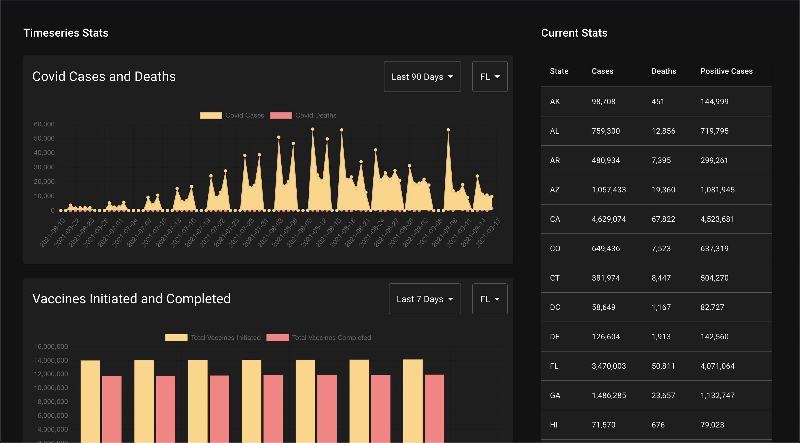

# Covid Tracker built by Jithen Shriyan
Built this tracker using React and the Covid Act Now API.

# Demo


# Try it Yourself!
1. Clone the code from GitHub
2. Sign up for an API Key from Covid Act Now (https://apidocs.covidactnow.org)
3. Assign your API Key to REACT_APP_COVID_API_KEY in a .env file
```dosini
REACT_APP_COVID_API_KEY="Your_API_KEY"
```
4. Run npm start
```bash
npm start
```